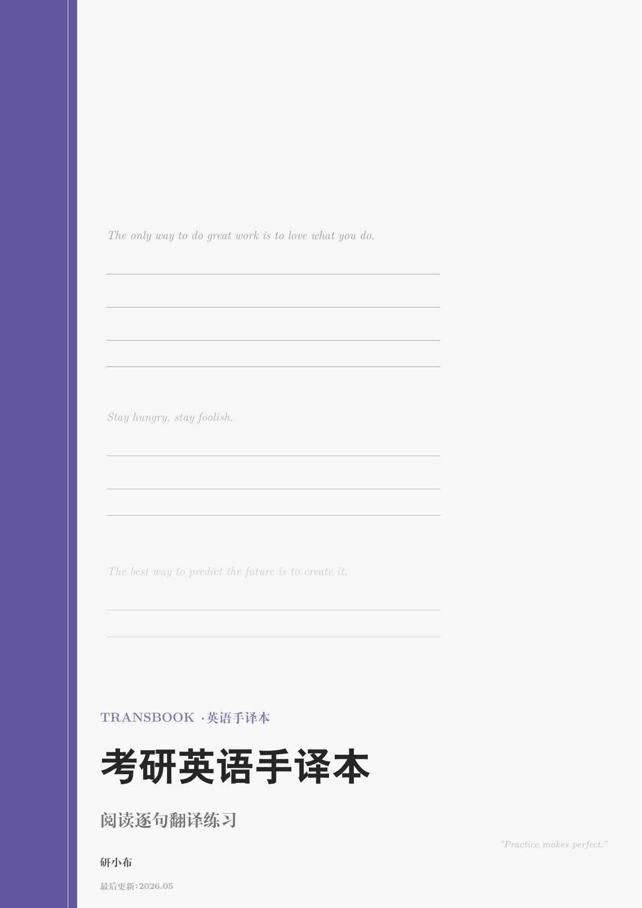
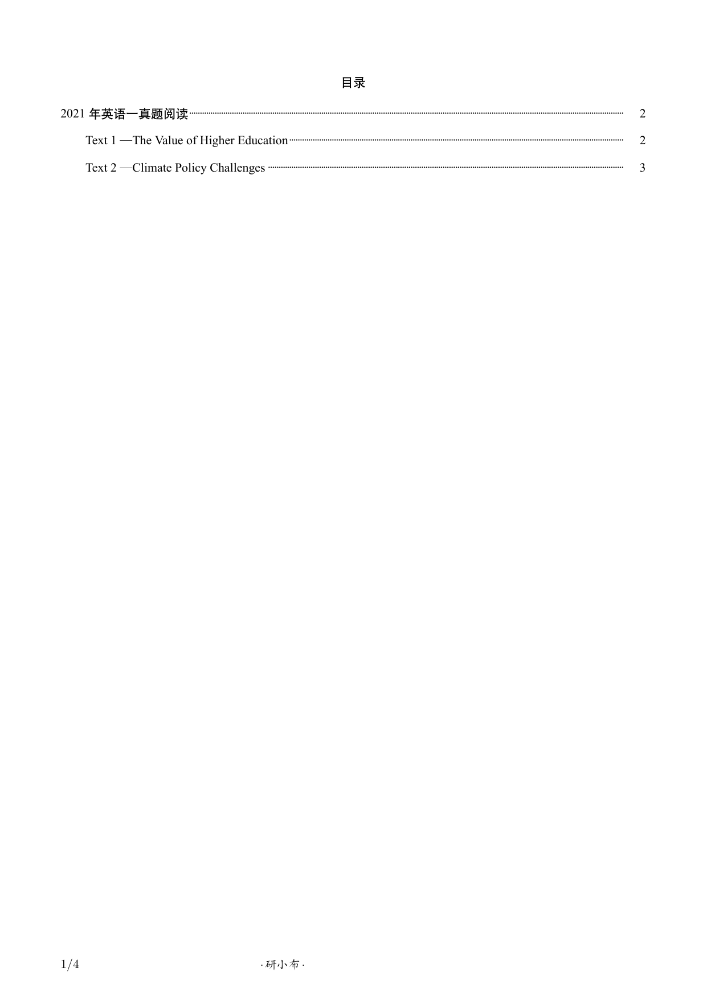
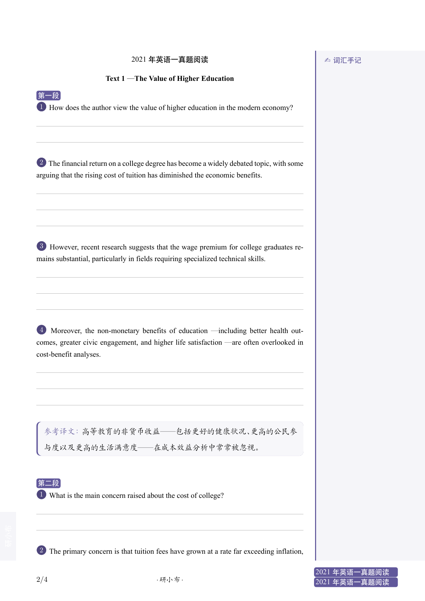
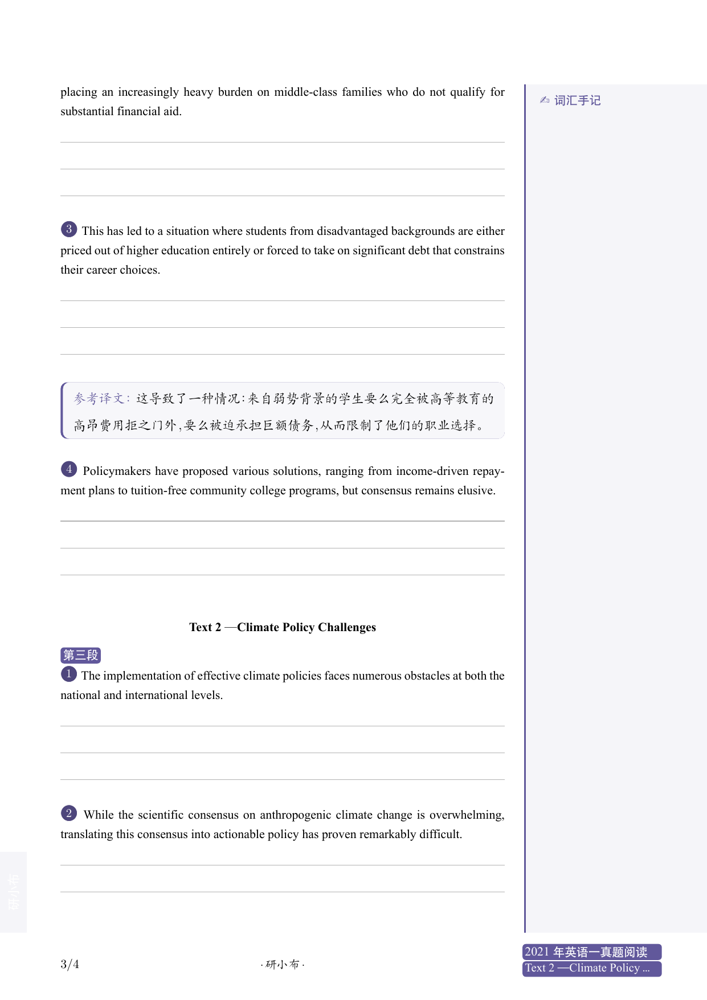

<div align="center">
  
</div>

<div align="center">
  
  
  </br>
  
  
  
</div>

<div align="center">
  <a href="https://exbook.github.io/transbook/">官方网站</a>
</div>

---

# 简介

**TransBook** 是一个专为考研英语阅读理解翻译练习设计的 LaTeX 文档类。输入英文句子，自动根据句子长度生成翻译空白横线，右侧还配有「词汇手记」区域用于记录生词和短语。

<div align="center">
  
  &nbsp;
  
  <br>
  
  &nbsp;
  
</div>

**功能特点：**

1. **智能横线生成**：`\Sentence` 命令自动测量句子宽度，根据行宽计算所需翻译横线数量，无需手动调整
2. **段落自动分组**：`Paragraph` 环境自动标注「第一段」「第二段」……，`reset` 参数可重置段落内句子编号
3. **带圈句子编号**：每句前自动生成主题色圆形编号，清晰标记句序
4. **词汇手记区**：页面右侧约 60mm 宽的专用笔记区域，浅色填充 + 主题色左边界线，标题「词汇手记」
5. **参考译文**：`translation` 环境，`showtrans` 选项一键显示/隐藏译文
6. **「稿纸手写」风格封面**：左侧 12% 窄主题色竖条 + 右侧英文例句与翻译横线装饰
7. **12 种颜色主题**：封面、句子编号、侧边栏全部跟随主题色切换
8. **深色模式**：全局 `darkmode` 选项
9. **支持 A4 / B5**：文档类选项一键切换
10. **外部配置**：`config.tex` 管理品牌文字、主题色、水印等全部设置

---

# 快速开始

```bash
# 编译
latexmk main.tex

# 或直接使用 xelatex
xelatex main.tex

# 清理
latexmk -c
```

---

# 文档类参考

## 文档类选项

| 选项 | 默认 | 说明 |
|------|------|------|
| `a4paper` / `b5paper` | a4paper | 纸张尺寸 |
| `adobe` / `ubuntu` / `mac` / `windows` / `fandol` | fandol | 中文字体集 |
| `printmode` | false | 双面打印 + 装订边距 |
| `online` | false | 封面显示勘误链接 |
| `water` | false | 页面水印 |
| `darkmode` | false | 深色模式 |
| `showtrans` | false | 显示参考译文 |

## 封面设置

打开 `config.tex`：

```latex
\Title{考研英语手译本}
\Subtitle{阅读逐句翻译练习}
\Author{研小布}
\Motto{Practice makes perfect.}
\UpdateTime{2026.05}
```

## 主题颜色

```latex
% 经典色：\blue \green \purple \orange（默认）
% MBTI 色：\infj \enfp \infp \esfp \intj \entp \isfj \enfj
\setThemeColor{\purple}
```

## 品牌文字

```latex
\FooterText{此手译本由公众号【研小布】排版制作}
\SidebarTitle{词汇手记}
\BrandName{研小布}
```

---

# 命令参考

## 段落与句子

```latex
\section{2021 年英语一真题阅读}
\subsection{Text 1 — The Value of Higher Education}

\begin{Paragraph}[reset]       % reset 可选：重置段落内句子编号
    \Sentence{How does the author view the value of higher education?}

    \Sentence{The financial return on a college degree has become a
    widely debated topic.}

    \Sentence{Recent research suggests that the wage premium for
    college graduates remains substantial.}
    \begin{translation}
        近期研究表明，大学毕业生的工资溢价仍然可观。
    \end{translation}
\end{Paragraph}
```

- `Paragraph` 环境：自动标注「第一段」「第二段」……，`reset` 参数重置句子编号
- `Sentence` 命令：自动测量句子宽度，生成对应数量的翻译横线
- `translation` 环境：参考译文，由 `showtrans` 选项控制显示/隐藏

## 工具命令

| 命令 | 说明 |
|------|------|
| `\blankbox` / `\eblankbox` | 中文/英文空括号 |
| `\blankline` | 空白下划线 |
| `\textwater` | 渲染水印文字 |
| `\noreftitle{标题}` | 无索引标题 |

---

# 完整示例

`main.tex`：

```latex
\documentclass[a4paper, showtrans]{TransBook}

\begin{document}

\include{config}
\maketitle

\tableofcontents
\clearpage

\section{2021 年英语一真题}

\subsection{Text 1 — The Value of Higher Education}

\begin{Paragraph}[reset]
    \Sentence{How does the author view the value of higher education?}

    \Sentence{The financial return on a college degree has become a
    widely debated topic.}
    \begin{translation}
        大学学位带来的经济回报已成为广泛讨论的话题。
    \end{translation}

    \Sentence{Recent research suggests that the wage premium for
    college graduates remains substantial.}
    \begin{translation}
        近期研究表明，大学毕业生的工资溢价仍然可观。
    \end{translation}
\end{Paragraph}

\end{document}
```

---

# 项目结构

```
TransBook/
├── TransBook.cls          # 类文件
├── config.tex             # 用户配置
├── .latexmkrc             # 编译配置
├── main.tex               # 示例文档
└── img/                   # 图片（可选）
    ├── cover.jpg
    └── water.png
```

---

## 许可证

MIT License
